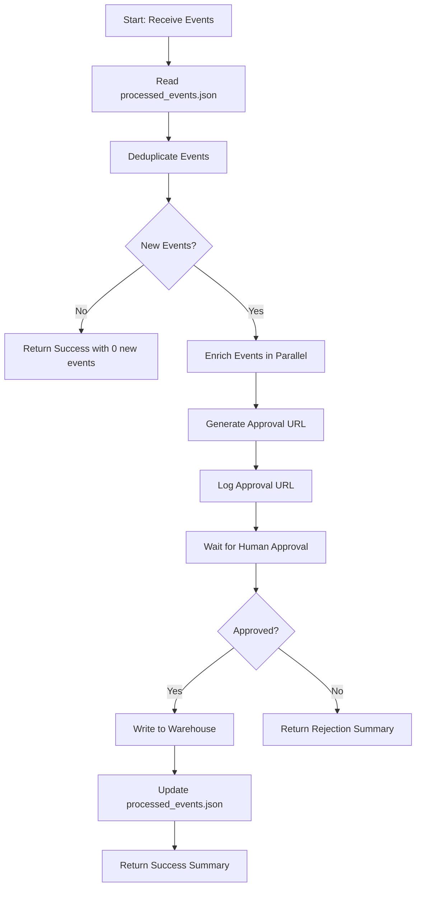

# Event-Driven ETL Orchestrator

## Overview

This Windmill workflow orchestrates an event-driven ETL process with deduplication, enrichment, and human approval capabilities.

## Workflow Location

- **Main File**: `/home/user/windmill-project/f/workflows/etl_orchestrator.ts`
- **State File**: `/home/user/windmill-project/processed_events.json`

## Features

### 1. Event Deduplication
- Reads previously processed event IDs from `processed_events.json`
- Filters out duplicate events before processing
- Maintains state across workflow runs

### 2. Parallel Event Enrichment
- Enriches new events in parallel batches
- Maximum 5 concurrent enrichments
- Adds enrichment metadata (timestamp, category, etc.)

### 3. Human Approval Flow
- Generates approval URL before writing to warehouse
- Pauses workflow execution pending approval
- Logs approval URL for easy access

### 4. Conditional Execution
- **On Approval**: Writes to warehouse, updates state, returns success summary
- **On Rejection**: Returns rejection summary without writing

## Parameters

### Required
- `events`: Array<{ id: string, type: string, payload: any }>
  - Array of events to process
  - Each event must have: id, type, and payload

### Optional
- `warehouseTarget`: string (default: "main")
  - Target data warehouse identifier
  - Can be used for different environments (dev, staging, prod)

## Return Types

### Success Summary (Approved)
```typescript
{
  status: "approved";
  warehouseTarget: string;
  totalEvents: number;
  newEventsProcessed: number;
  duplicateEventsSkipped: number;
  processedEventIds: string[];
  enrichedEvents: EnrichedEvent[];
  approvalComment?: string;
}
```

### Rejection Summary (Rejected)
```typescript
{
  status: "rejected";
  warehouseTarget: string;
  totalEvents: number;
  newEventsPending: number;
  duplicateEventsSkipped: number;
  pendingEventIds: string[];
  rejectionComment?: string;
}
```

## Usage Example

```typescript
// Example events
const events = [
  {
    id: "evt_001",
    type: "user_signup",
    payload: { userId: "user123", email: "user@example.com" }
  },
  {
    id: "evt_002",
    type: "purchase",
    payload: { userId: "user123", amount: 99.99 }
  }
];

// Run the workflow
const result = await main(events, "production");
```

## Workflow Flow Diagram



## State Management

The workflow maintains state in `processed_events.json`:
- Stores array of processed event IDs
- Updated only on successful approval
- Prevents duplicate processing across runs

## Enrichment Logic

Current enrichment adds:
- `enrichedAt`: ISO timestamp of enrichment
- `enrichedData.processingTimestamp`: Same timestamp
- `enrichedData.eventTypeCategory`: Extracted from event type

This can be customized to call external Windmill tasks for more complex enrichment.

## Approval Process

1. Workflow generates approval URL
2. Logs URL to console
3. Pauses execution
4. Human reviews via Windmill UI
5. Approves or Rejects
6. Workflow resumes with appropriate action

## Error Handling

- Missing `processed_events.json`: Starts with empty array
- Invalid JSON in state file: Starts with empty array
- No new events: Returns early with success summary

## Extending the Workflow

### Custom Enrichment
Replace the `enrichEvent` function to call external Windmill tasks:

```typescript
async function enrichEvent(event: Event): Promise<EnrichedEvent> {
  const enriched = await wmill.runFlow("f/enrichment_flow", { event });
  return enriched;
}
```

### Custom Warehouse Integration
Replace the `writeToWarehouse` function:

```typescript
async function writeToWarehouse(events: EnrichedEvent[], target: string): Promise<void> {
  const client = getWarehouseClient(target);
  await client.insert("events", events);
}
```

## Dependencies

- Windmill SDK (`windmill`)
- TypeScript types for events and results

## Notes

- Workflow is idempotent: running same events multiple times only processes new ones
- Concurrent enrichment limited to 5 to prevent resource exhaustion
- State file must be writable by the workflow
- Approval URL is logged for easy access